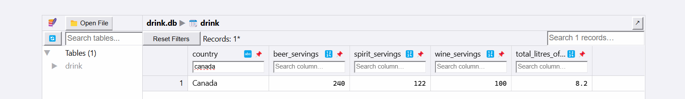
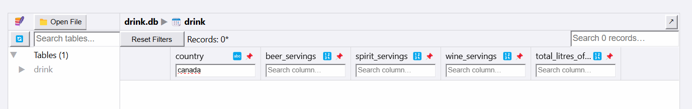
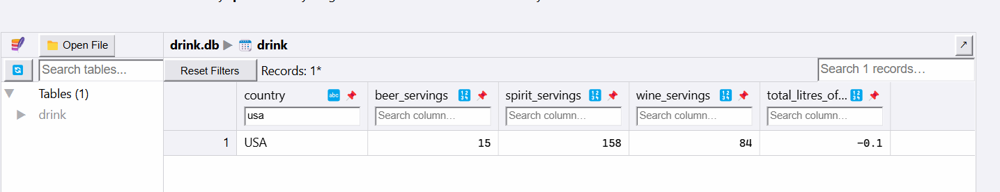
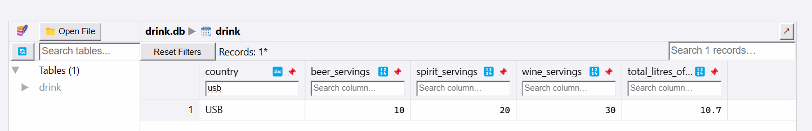
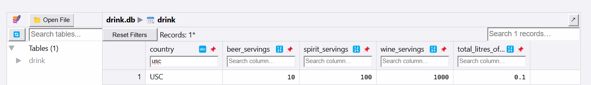

# Allen_Wang_miniproj_5

[](https://github.com/nogibjj/Allen_Wang_miniproj_5/actions/workflows/CICD.yml)

## Overview

This project demonstrates connecting to a SQL database, performing CRUD operations (Create, Read, Update, Delete), and writing two distinct SQL queries. The project is implemented in Python, with CI/CD setup for testing and validation.

## Project Structure

- **.devcontainer/**: Configuration for the development container.
- **Makefile**: Provides commands for setup, formatting, linting, testing, and running SQL queries:
  - `make install`: Installs dependencies.
  - `make format`: Formats Python files.
  - `make lint`: Lints Python files.
  - `make test`: Runs tests.
  - `make all`: Runs all tasks (install, format, lint, and test).
  - `make transform`: Transforms data and stores it in the `drink.db` database.
  - `make query1`: Inserts a new record into the `drink` table.
  - `make query2`: Updates an existing record in the `drink` table.
- **.github/workflows/ci.yml**: CI/CD pipeline configuration.
- **main.py**: Python script to handle data transformation, and database queries.
- **README.md**: Setup, usage instructions, and project description.

## CRUD Operations

- **Create**: Insert new records into the database.
    ```bash
    Python main.py create $(country name) $(beer servings) $(spirit servings) $(wine servings) $(total litres_of_pure_alcohol)
    ```

- **Read**: Select and retrieve data.
    ```bash
    Python main.py read
    ```

- **Update**: Modify existing records.
    ```bash
    Python main.py update $(country name) $(beer servings)
    ```

- **Delete**: Remove records from the database.
    ```bash
    Python main.py delete $(country name)
    ```


## Setup

1. **Clone the repository**:

    ```bash
    git clone https://github.com/nogibjj/Allen_Wang_miniproj_5.git
    cd Allen_Wang_miniproj_5
    ```

2. **Install dependencies**:

    ```bash
    make install
    ```

3. **Format code**:

    ```bash
    make format
    ```

4. **Lint code**:

    ```bash
    make lint
    ```

5. **Test code**:

    ```bash
    make test
    ```
## Demonstration of Database Changes

The following changes were made to the `drink` table in the `drink.db` database through CI/CD and test_main.py:

1. **Deleted** the record for the country **Canada**.
   
   

2. **Updated** the record for the country **USA**:
   - `beer_servings = 15`
   - `total_litres_of_pure_alcohol = -0.1`
  
    

3. **Added** a new record for the country **USB**.
   

4. **Added** a new record for the country **USC**.
   
